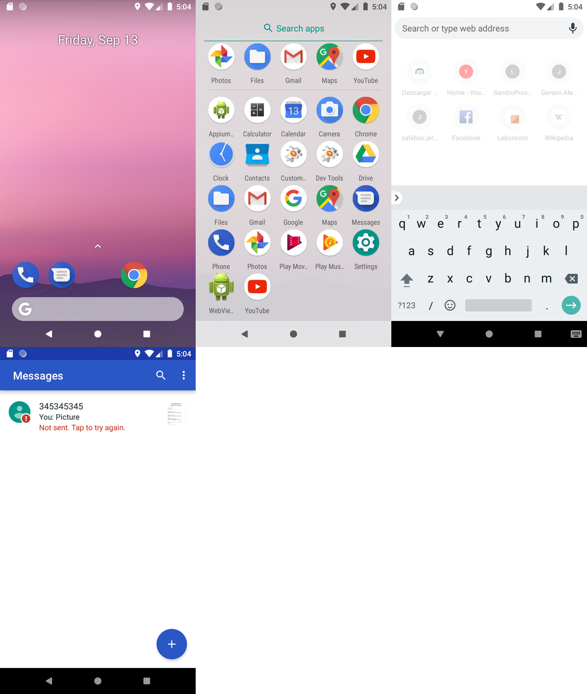

# ScreenShot Tools

Commands to take captures easily on android and ios and combine them with an easy interface and with support for windows linux and macos


# Download

just download in  release section [https://github.com/jerson/screenshot_tools/releases](Release Section)

# Command line

```bash
NAME:
   ScreenShot Tools

USAGE:
   screenshot_tools [global options] command [command options] [arguments...]

VERSION:
   0.1.0

COMMANDS:
   help, h  Shows a list of commands or help for one command

   debug:
     dump-config, dc  dump-config
     report, r        report

   evidences:
     merge-images, m  merge-images
     compress, c      compress

   nexus:
     upload-nexus, un  upload-nexus app-10-10-2010.apk

   screenshot:
     screenshot-session, ss  screenshot-session
     screenshot, s           screenshot

GLOBAL OPTIONS:
   --help, -h     show help
   --version, -v  print the version

```

## ScreenShot session
```bash
NAME:
   screenshot_tools screenshot-session - screenshot-session

USAGE:
   
screenshot-session
screenshot-session name

CATEGORY:
   screenshot

DESCRIPTION:
   start session for take many screenshots

OPTIONS:
   --adb value, -a value          ADB path used when platform=android (default: "adb")
   --automator value, --au value  Automator used when platform=ios (default: "/usr/bin/automator")
   --platform value, -p value     Platform: ios,android,ios-simulator,desktop (default: "android")

```
```bash
? Name: sample session

 Insert key for do things:
 ------------------------
 help:
	C: capture screenshot
	E: capture desktop screenshot
	M: merge screenshots and close
	D: delete last screenshot
	L: list captured screenshots
	R: reset all captured screenshots
	A: add custom screenshot from filesystem (beta)
	Q: quit
	H: print help

	Note: keys are case sensitive

INFO[0008] new screenshot: sample session/sample session_01.png 
INFO[0009] new screenshot: sample session/sample session_02.png 
List:
[
 "sample session/sample session_01.png",
 "sample session/sample session_02.png"
]
Removed last: sample session/sample session_02.png
INFO[0014] new screenshot: sample session/sample session_02.png 
Merged images:
Output file: sample session.png

```

### Output


## ScreenShot 

```bash
NAME:
   screenshot_tools screenshot - screenshot

USAGE:
   
screenshot
screenshot "sample name"

CATEGORY:
   screenshot

DESCRIPTION:
   capture screenshot

OPTIONS:
   --adb value, -a value          ADB path used when platform=android (default: "adb")
   --automator value, --au value  Automator used when platform=ios (default: "/usr/bin/automator")
   --platform value, -p value     Platform: ios,android,ios-simulator,desktop (default: "android")

```